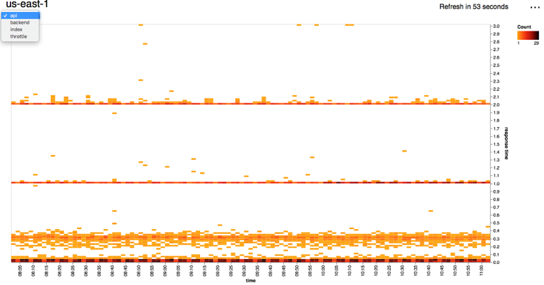
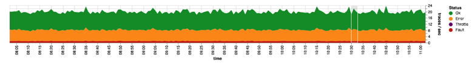
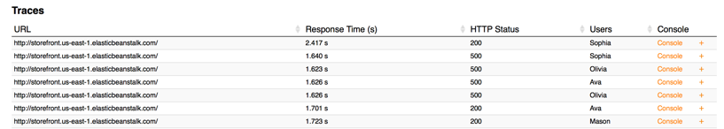

# AWS X-Ray Sample App
This sample application uses the AWS X-Ray API's to generate a 3-hour or 7-day latency heatmap and health graph for individual services that make up your application. It uses [Vega-Lite](https://vega.github.io/vega-lite/) to generate the heatmap and health graph. The sample can be run locally or deployed to [AWS Elastic Beanstalk](http://aws.amazon.com/elasticbeanstalk/).

## License
This sample application is licensed under the Apache 2.0 License. 

## Requirements
Ruby 2.3 or later with bundler.

## Features
#### Latency Heatmap


A heatmap showing the latency over time (3-hour or 7-days) for a particular service or edge. You can click+drag to select an area to search for traces that meet that criteria.

#### Health Graph


A service health graph that shows how the health of a particular service or edge has changed over time. You can click+drag to select an area to search for traces that meet that criteria.

#### Linking to X-Ray console


Listing of traces that meet the criteria for the selected areas in the heatmap or the health graph. Enables you to easily bring up the individual traces in the X-Ray console.

## Getting Started
#### Local
```
$ bundle install --path vendor/bundle
$ bundle exec rackup
```
Open your browser to http://localhost:9292/

*Note: The sample app default to the us-east-1 region. If your X-Ray data is in another region, click on the ... on the top right to bring up the region selection panel and select a different region.*

#### AWS Elastic Beanstalk
You can get started using the following steps:
  1. [Install the AWS Elastic Beanstalk Command Line Interface (CLI)](http://docs.aws.amazon.com/elasticbeanstalk/latest/dg/eb-cli3-install.html).
  2. Create an IAM Instance Profile named **aws-elasticbeanstalk-sample-role** with the policy in [iam_policy.json](iam_policy.json). For more information on how to create an IAM Instance Profile, see [Create an IAM Instance Profile for Your Amazon EC2 Instances](https://docs.aws.amazon.com/codedeploy/latest/userguide/how-to-create-iam-instance-profile.html).
  3. Run `eb init -r <region> -p "Ruby"` to initialize the folder for use with the CLI. Replace `<region>` with a region identifier such as `us-west-2` (see [Regions and Endpoints](https://docs.amazonaws.cn/en_us/general/latest/gr/rande.html#elasticbeanstalk_region) for a full list of region identifiers). For interactive mode, run `eb init` then,
    1. Pick a region of your choice.
    2. Select the **[ Create New Application ]** option.
    3. Enter the application name of your choice.
    4. Answer **yes** to *It appears you are using Node.js. Is this correct?*.
    7. Choose whether you want SSH access to the Amazon EC2 instances.  
      *Note: If you choose to enable SSH and do not have an existing SSH key stored on AWS, the EB CLI requires ssh-keygen to be available on the path to generate SSH keys.*  
  4. Run `eb create --instance_profile aws-elasticbeanstalk-sample-role` to begin the creation of your environment.
    1. Enter the environment name of your choice.
    2. Enter the CNAME prefix you want to use for this environment.
  5. Once the environment creation process completes, run `eb open` to open the application in a browser.
  6. Run `eb terminate --all` to clean up.
